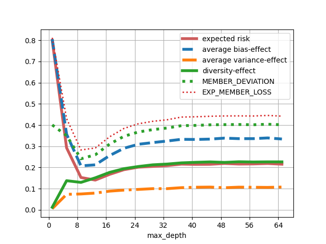

# 2023-07-07

- "sweet spot" at a certain depth, then risk increases again -- is this the notion of max depth as a regulariser?
- interesting to see how bias increases sharply again but seems to be somewhat mitigated by
    continuously increasing diversity
- this relationship would be fascinating to investigate
    - the individual models are worse, but because of "better" diversity (wasted votes etc?), we can still mitigate
        some individual performance?
