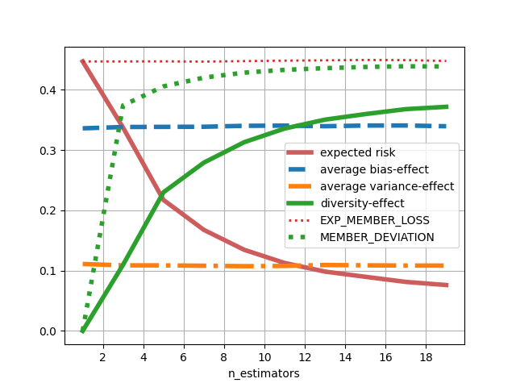

# 2023-06-10
- entire consideration should apply to any bagging ensemble, not limited to trees/forests
- recall that `member-deviation` is an upper-bound for diversity-effect (triangle inequality)
- interesting that `member-deviation` grows faster than overall diversity-effect

# 2023-06-22
- expected average member loss stays constant with ensemble size, as expected. nothing surprising happening here.
